# TaxFacto

### Shared or Specialized? Parameter-Efficient Adaptation for Legal Rhetorical Role Classification

[](https://www.python.org/)
[](https://pytorch.org/)
[](https://huggingface.co/docs/transformers/)


**TaxFacto** is an experimental framework for studying **shared versus role-specialized parameter-efficient adaptation** in legal rhetorical-role classification.

The central question is simple:

> **When adapting legal language models to rhetorical roles, is a single shared low-rank adaptation sufficient, or does role-aware specialization provide a consistent advantage?**

The repository contains the training code, benchmark manifests, statistical analyses, cross-domain transfer experiments, native-taxonomy validation, ablations, logs, and paper-ready figures used to study this question across multiple legal datasets and encoder backbones.

---

## Overview

Legal documents contain recurring functional units such as facts, arguments, precedents, statutes, ratios, and rulings. These roles are related, but they are not interchangeable: the linguistic evidence useful for identifying a precedent is not necessarily the same evidence useful for identifying an argument or a ruling.

TaxFacto compares several adaptation strategies along this spectrum:

- **Frozen encoder** — only the classification layer is trained.
- **Shared LoRA** — one shared low-rank adaptation is used for all rhetorical roles.
- **Wide-head LoRA** — shared LoRA with a larger classification head.
- **Category LoRA** — a parameter-matched class-specific low-rank output head.
- **Role Adapter** — shared encoder LoRA plus class-specific nonlinear residual adaptation.
- **Full fine-tuning** — all model parameters are updated.
- **True category LoRA** — a mechanistic ablation with genuinely role-specific encoder LoRA branches.

The experiments are designed to separate three questions:

1. **Performance:** does role-aware specialization improve rhetorical-role classification?
2. **Efficiency:** how much of full fine-tuning performance can be recovered with a tiny trainable parameter budget?
3. **Transfer:** does specialization remain useful under dataset, domain, jurisdiction, and label-taxonomy shift?

---

## Experimental scale

The current experimental package contains **530 completed training runs**.

| Experiment family | Runs |
|---|---:|
| Main benchmark + rank/mechanistic experiments | 335 |
| Cross-domain transfer | 168 |
| Native-taxonomy validation | 27 |
| **Total** | **530** |
| Failed runs | **0** |

The main benchmark uses:

- **5 evaluation domains**
- **3 encoder backbones**
- **6 adaptation strategies**
- **3 random seeds**
- additional LoRA-rank sweeps
- mechanistic role-specific encoder ablations

The cross-domain study evaluates all **20 directed source → target pairs** among the five Common-7 domains.

---

# Datasets

TaxFacto combines several legal rhetorical-role resources with different annotation schemes and jurisdictions.

| Dataset | Domain / jurisdiction | Use |
|---|---|---|
| **LegalEval** | Indian legal judgments | Common-7 + native taxonomy |
| **LegalSeg** | Large legal rhetorical-role corpus | Common-7 |
| **MARRO India** | Indian judgments | Common-7 |
| **MARRO UK** | UK judgments | Common-7 |
| **IL-TUR CL** | Indian Constitutional Law | Common-7 + native taxonomy |
| **IL-TUR IT** | Indian Income Tax | Common-7 + native taxonomy |

A previously considered DeepRhole corpus was found to duplicate the MARRO India data and is therefore **not treated as an independent benchmark domain**.

Raw third-party corpora are not redistributed in this repository. The repository instead contains lightweight manifests, mappings, statistics, and derived experimental metadata required to reconstruct the benchmark from the original sources.

---

## Common-7 rhetorical-role space

For controlled cross-dataset experiments, heterogeneous native taxonomies are mapped into seven shared functional roles:

| Label | Meaning |
|---|---|
| `ARG` | Argument |
| `FAC` | Fact |
| `PRE` | Precedent |
| `RATIO` | Ratio / reasoning |
| `RLC` | Ruling by lower court |
| `RPC` | Ruling by present court |
| `STA` | Statute |

Labels without a defensible Common-7 correspondence are excluded from harmonized evaluation rather than forced into an artificial mapping.

Native-taxonomy experiments are retained separately to test whether conclusions are artifacts of taxonomy harmonization.

---

# Models

Three encoder backbones are evaluated:

- **InLegalBERT**
- **LegalBERT**
- **DeBERTa-v3-base**

The same experimental protocol is applied across backbones wherever possible.

---

# Adaptation methods

## Shared LoRA

A conventional low-rank adaptation shared across all labels.

This is the primary PEFT baseline.

---

## Category LoRA

A parameter-matched **class-specific linear low-rank head**.

This baseline is important because it controls for the possibility that gains arise merely from giving each class additional parameters.

Despite its name in experiment identifiers, this variant should be interpreted as a **linear role-specific low-rank output head**, not as separate encoder-level LoRA modules.

---

## Role Adapter

The principal role-aware model combines:

1. shared Q/V LoRA adaptation in the encoder, and
2. a class-specific nonlinear residual transformation

of the form

\[
B_c\,\mathrm{GELU}(A_c h),
\]

where \(c\) indexes the rhetorical role.

The resulting model retains a very small trainable parameter budget while allowing different rhetorical roles to learn distinct residual transformations.

---

## True category LoRA

A more expensive mechanistic ablation assigns genuinely role-specific Q/V LoRA parameters inside the encoder.

It is implemented using functional model evaluation and is substantially more memory-intensive.

This experiment tests whether pushing specialization deeper into the encoder produces enough benefit to justify its computational cost.

---

# Main results

## Overall within-domain performance

Mean Macro-F1 across the 15 dataset × backbone evaluation cells:

| Method | Macro-F1 |
|---|---:|
| **Full FT** | **0.5856** |
| **Role Adapter** | **0.5583** |
| Category LoRA | 0.5562 |
| Wide-head | 0.5439 |
| Shared LoRA | 0.4960 |
| Frozen | 0.1867 |

Full fine-tuning remains the strongest method in absolute accuracy.

However, among parameter-efficient methods, **Role Adapter obtains the highest overall mean performance**.

---

## Role Adapter vs Shared LoRA

Across the 15 within-domain dataset × backbone cells:

- mean improvement: **+0.0622 Macro-F1**
- wins: **15 / 15**
- hierarchical bootstrap 95% CI for the Role Adapter advantage:
  **[+0.0378, +0.0924]**

This is the most consistent result in the study.

The comparison indicates that the benefit is not restricted to a single dataset or backbone.

---

## Role Adapter vs Full Fine-Tuning

Full fine-tuning retains a modest average accuracy advantage:

- Full FT − Role Adapter: **+0.0273 Macro-F1**
- bootstrap 95% CI:
  **[+0.0053, +0.0544]**

Accordingly, TaxFacto does **not** claim statistical equivalence between Role Adapter and full fine-tuning.

The relevant trade-off is instead that Role Adapter approaches full fine-tuning while training only a tiny fraction of the parameters.

---

## Parameter-matched controls

The differences between Role Adapter, Category LoRA, and Wide-head adaptation are much smaller than the gap between Role Adapter and Shared LoRA.

This matters for interpretation:

> the experiments strongly support the value of **enriched role-aware adaptation over vanilla shared LoRA**, but they do not support the stronger claim that one particular specialization mechanism universally dominates other parameter-matched role-aware alternatives.

This distinction is reflected throughout the statistical analysis.

---

# Efficiency

For InLegalBERT, the Role Adapter uses approximately:

- **386k trainable parameters**
- about **0.35%** of the model
- roughly **3.0 GB peak GPU memory**
- substantially less training time and memory than full fine-tuning

while full fine-tuning updates approximately:

- **109.5M parameters**
- **100%** of the model
- roughly **4.6 GB peak GPU memory**

Thus the Role Adapter uses roughly **two orders of magnitude fewer trainable parameters** while retaining much of the full-fine-tuning accuracy.

<p align="center">
  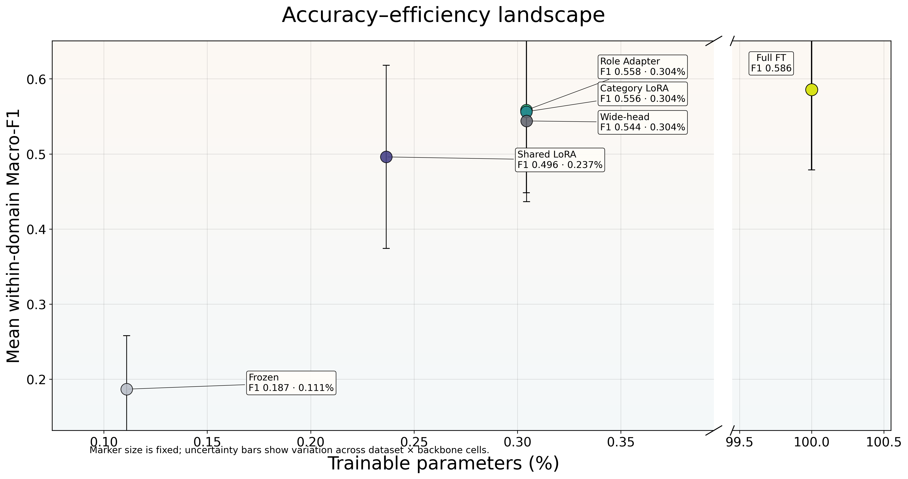
</p>

---

# Cross-domain transfer

The transfer study trains on one Common-7 source domain and evaluates on another.

All **20 directed source → target combinations** are evaluated for Shared LoRA and Role Adapter.

A controlled subset of **8 transfer directions** additionally includes Full FT and Category LoRA, enabling method comparisons on exactly the same source-target pairs.

---

## Role Adapter vs Shared LoRA in transfer

Across all 20 off-diagonal transfer directions:

- mean Role Adapter improvement: **+0.0330 Macro-F1**
- median improvement: **+0.0211**
- Role Adapter wins: **17 / 20**
- losses: **3 / 20**

The largest observed gains include transfer from MARRO-UK to several target domains.

Examples include:

| Direction | Role − Shared |
|---|---:|
| MARRO-UK → LegalEval | +0.1209 |
| MARRO-UK → IL-TUR CL | +0.1046 |
| MARRO-UK → IL-TUR IT | +0.0919 |
| IL-TUR IT → MARRO-IN | +0.0615 |

The few negative differences are small in magnitude.

<p align="center">
  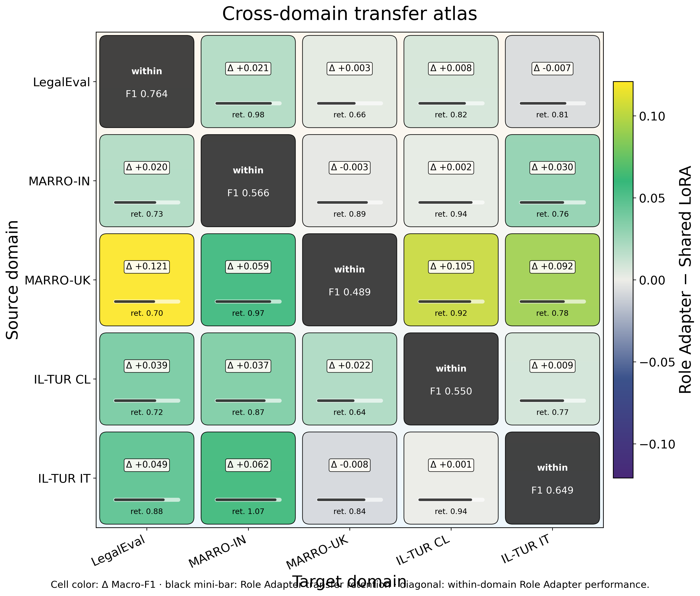
</p>

---

## Fair core-8 transfer comparison

To avoid comparing methods over different sets of transfer directions, a controlled eight-direction subset is analyzed separately.

On these same eight directions:

| Comparison | Mean Δ | Wins |
|---|---:|---:|
| Role Adapter − Shared LoRA | +0.0287 | 7 / 8 |
| Category LoRA − Shared LoRA | +0.0281 | 8 / 8 |
| Full FT − Role Adapter | +0.0040 | 4 / 8 |
| Category LoRA − Role Adapter | −0.0006 | 3 / 8 |

After multiple-comparison correction, the small core-8 sample does not justify treating every directional tendency as statistically conclusive.

The transfer analysis is therefore used primarily as evidence of **cross-domain consistency**, rather than as a substitute for the larger within-domain statistical test.

---

# IL-TUR directional asymmetry

The controlled IL-TUR experiments expose an interesting domain asymmetry.

Transfer from:

**Income Tax → Constitutional Law**

retains substantially more within-domain performance than transfer in the reverse direction:

**Constitutional Law → Income Tax**.

This trend appears across several adaptation strategies rather than being unique to a single method.

<p align="center">
  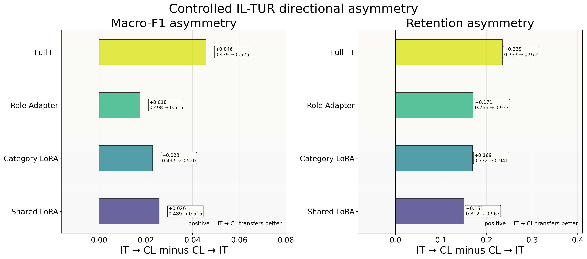
</p>

---

# Native-taxonomy validation

Common-7 harmonization is useful for controlled transfer experiments, but it could potentially manufacture or suppress adaptation effects.

To test this, LegalEval and both IL-TUR subsets are also evaluated using their **native label spaces**.

Role Adapter minus Shared LoRA:

| Dataset | Δ Macro-F1 |
|---|---:|
| LegalEval | +0.0412 |
| IL-TUR IT | +0.0762 |
| IL-TUR CL | +0.0007 |

The benefit therefore persists clearly on LegalEval and IL-TUR IT without Common-7 mapping, while IL-TUR CL becomes effectively neutral.

This suggests that the main result is **not solely an artifact of label harmonization**, while also showing that the magnitude of the effect remains dataset dependent.

<p align="center">
  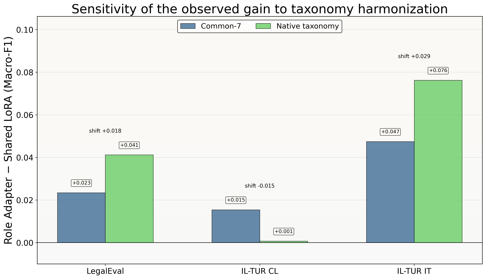
</p>

---

# LoRA rank sensitivity

The main PEFT configuration uses rank \(r=8\).

A separate sweep evaluates:

\[
r \in \{2,4,8,16,32\}.
\]

Mean results show different rank-response behavior across adaptation strategies:

| Rank | Shared LoRA | Category LoRA | Role Adapter |
|---:|---:|---:|---:|
| 2 | 0.5025 | 0.5966 | 0.5860 |
| 4 | 0.5411 | 0.5863 | 0.5958 |
| 8 | 0.5748 | 0.6007 | **0.6047** |
| 16 | 0.5884 | **0.6019** | 0.6007 |
| 32 | **0.5916** | 0.5938 | 0.5954 |

Role Adapter reaches its best mean performance at **rank 8**, whereas Shared LoRA continues improving at larger ranks.

<p align="center">
  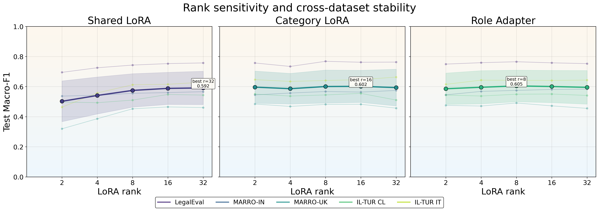
</p>

---

# Mechanistic ablation

A natural question is whether each rhetorical role should receive its own LoRA adaptation **inside the encoder itself**.

The `true_category_lora` ablation tests this directly.

Compared with the Role Adapter, true category-specific encoder LoRA changes Macro-F1 by:

| Dataset | True category LoRA − Role Adapter |
|---|---:|
| LegalEval | +0.0035 |
| IL-TUR CL | −0.0471 |
| IL-TUR IT | −0.0129 |
| MARRO-IN | −0.0171 |
| MARRO-UK | −0.0245 |

It improves only **1 of 5** datasets while requiring dramatically more GPU memory.

Peak memory is approximately:

- Role Adapter: ~3 GB on InLegalBERT
- True category encoder LoRA: ~17 GB

The experiment therefore provides little evidence that deep role-specific encoder branching is worth its additional computational cost.

<p align="center">
  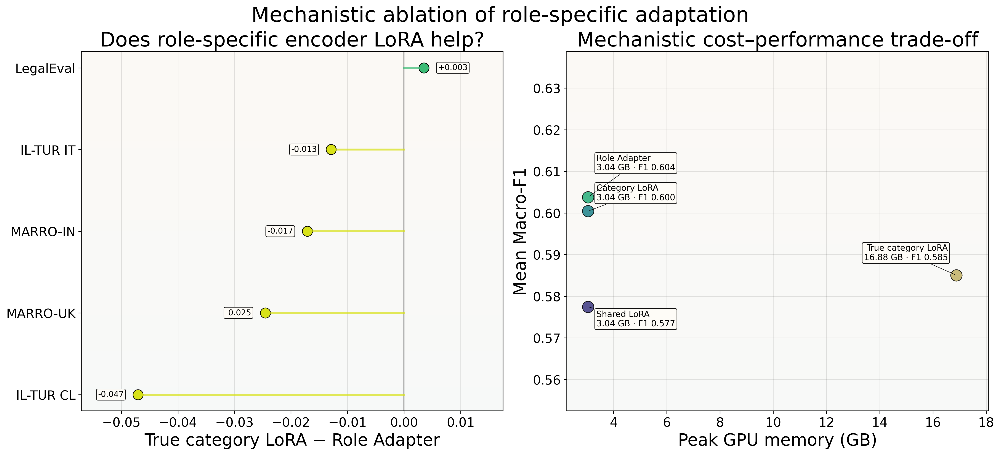
</p>

---

# Statistical analysis

The repository contains both conventional paired tests and hierarchical resampling analyses.

The statistical pipeline includes:

- Friedman tests across methods
- paired Wilcoxon signed-rank tests
- Holm multiple-comparison correction
- paired transfer analyses
- **10,000-replicate hierarchical document bootstrap**
- confidence intervals for principal method effects
- win/loss counts over atomic dataset × backbone or source → target cells

The bootstrap is particularly important because aggregate seed means alone do not capture document-level uncertainty.

The statistical results are stored under:

```text
results/final_analysis/
results/additional/analysis/
results/additional/bootstrap/
results/additional/fair_core8/
```

<p align="center">
  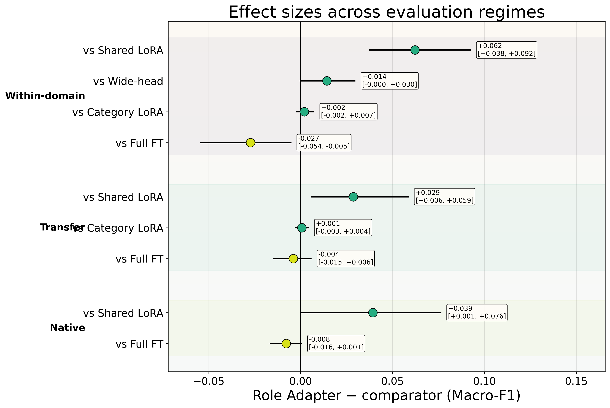
</p>

---

# Result visualizations

The repository includes a larger analysis suite than can reasonably fit in a single paper.

Examples include:

### Pairwise method dominance

<p align="center">
  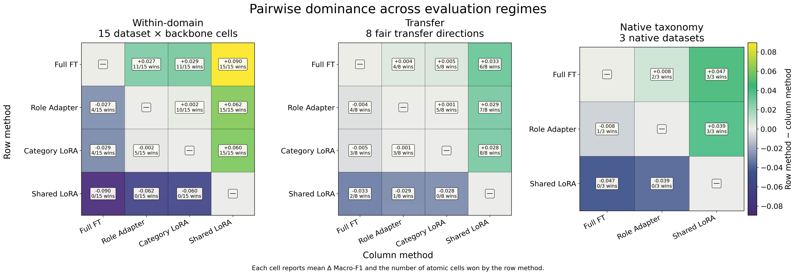
</p>

### Cross-regime consistency of Role Adapter gains

<p align="center">
  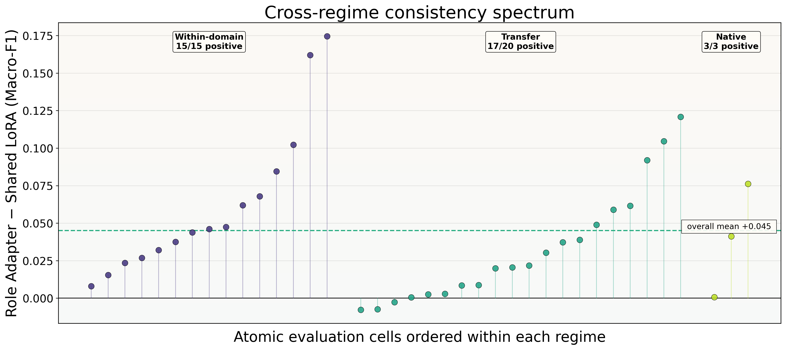
</p>

### Full-FT headroom recovery

<p align="center">
  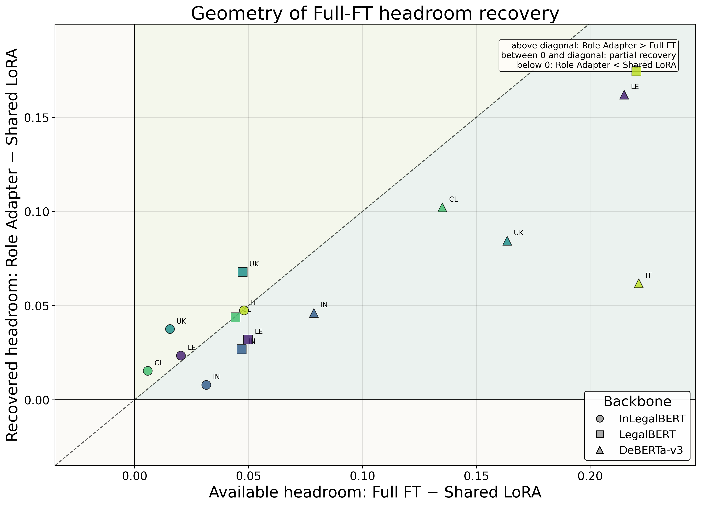
</p>

### Directed transfer topology

<p align="center">
  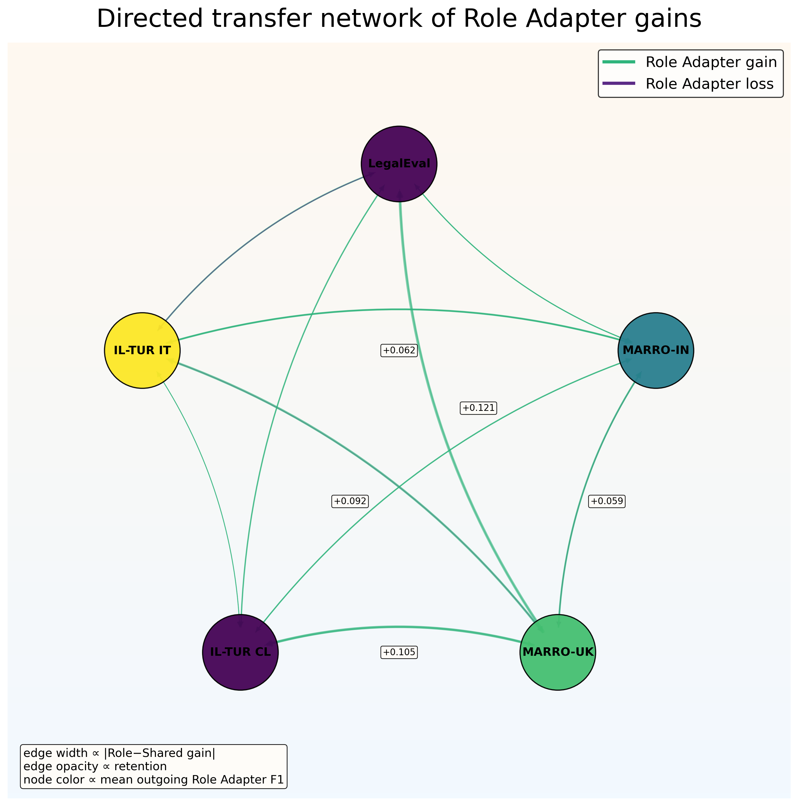
</p>

### Method behavior across datasets and backbones

<p align="center">
  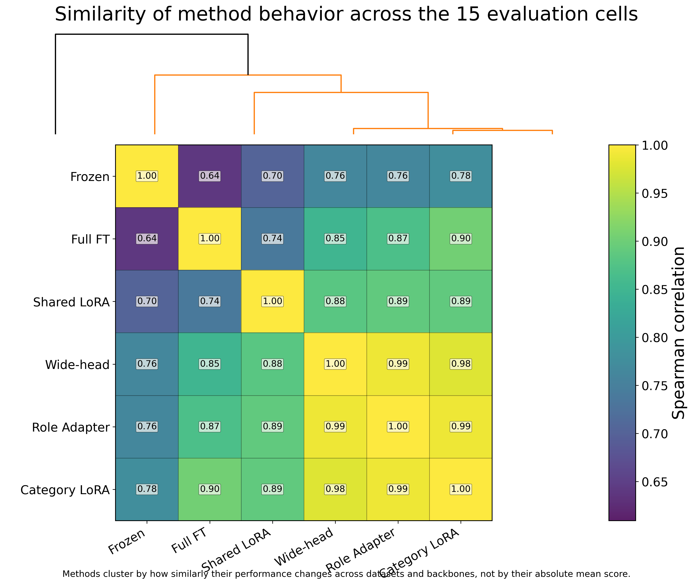
</p>

The full figure package is available in:

```text
results/paper_figures/
```

---

# Repository structure

```text
TaxFacto/
├── src/
│   ├── train.py
│   └── models_ablation.py
│
├── scripts/
│   ├── dataset construction and audit utilities
│   ├── benchmark / transfer runners
│   ├── statistical analysis scripts
│   ├── transfer analysis
│   └── paper figure generation
│
├── data/
│   ├── manifests/
│   └── manifests_final/
│
├── reports/
│   └── dataset and benchmark audits
│
└── results/
    ├── final_common7/
    │   └── per-run summaries and evaluation metadata
    │
    ├── final_analysis/
    │   └── main aggregated results
    │
    ├── additional/
    │   ├── analysis/
    │   ├── bootstrap/
    │   └── fair_core8/
    │
    └── paper_figures/
        └── final analysis figures
```

Large pretrained model weights, raw source datasets, checkpoints, and bulky prediction dumps are intentionally excluded from version control.

---

# Reproducing the environment

The experiments were run with an NVIDIA A100 GPU.

The main tested software stack is:

```text
Python              3.12
PyTorch             2.6.0 + CUDA 12.4
Transformers        4.46.3
PEFT                0.19.1
Accelerate          1.0.1
scikit-learn        1.5.2
NumPy               1.26.4
pandas              2.2.3
PyArrow             17.0.0
datasets            2.21.0
huggingface_hub     0.36.2
```

The training entry point is:

```bash
python src/train.py --help
```

The repository scripts contain the experiment orchestration used for benchmark, transfer, native-taxonomy, ablation, and analysis runs.

---

# Regenerating the final figures

Once the result tables are available:

```bash
python scripts/make_final_paper_figures.py
```

Final figures are written to:

```text
results/paper_figures/
```

including a combined gallery:

```text
results/paper_figures/00_gallery.png
```

---

# Reproducibility notes

Several safeguards are used throughout the benchmark:

- chronological or official dataset splits are preserved where applicable;
- duplicate text is removed with **test > dev > train** priority;
- normalized cross-split leakage is checked;
- source train/dev data are decontaminated against target test text before transfer experiments;
- transfer evaluation distinguishes diagonal within-domain results from true off-diagonal transfer;
- comparisons over different transfer subsets are not pooled as if they were directly comparable;
- all principal main-grid cells use three independent random seeds;
- document-level bootstrap uncertainty is reported separately from seed variation.

---

# Key takeaways

The current experiments support four main conclusions.

### 1. Shared adaptation leaves substantial performance on the table

Role Adapter improves over Shared LoRA in **all 15 within-domain dataset × backbone cells**, with a mean gain of approximately **6.2 Macro-F1 points**.

### 2. Role-aware PEFT substantially narrows the gap to full fine-tuning

Full fine-tuning remains the strongest method overall, but Role Adapter reaches much of its accuracy with roughly **0.35% trainable parameters** on InLegalBERT.

### 3. The benefit extends beyond within-domain evaluation

Role Adapter outperforms Shared LoRA in **17 of 20** cross-domain transfer directions.

### 4. Specialization helps, but deeper specialization is not automatically better

Parameter-matched Category LoRA and Wide-head controls are competitive with Role Adapter, while expensive role-specific encoder LoRA provides little additional benefit.

The evidence therefore favors **lightweight structured specialization**, rather than indiscriminate duplication of adaptation parameters.

---

# Status

TaxFacto is an active research repository.

Current repository contents correspond to the completed experimental and analysis phase:

- [x] dataset audit and harmonization
- [x] multi-backbone benchmark
- [x] PEFT architecture ablations
- [x] rank sensitivity
- [x] cross-domain transfer
- [x] native-taxonomy validation
- [x] mechanistic category-LoRA ablation
- [x] hierarchical bootstrap statistics
- [x] final paper figure suite
- [ ] manuscript release / citation information

---

# Citation

A paper citation will be added after manuscript release.

If you use the current code or experimental framework before then, please reference this repository:

```text
TaxFacto: Shared or Specialized?
A Multi-Dataset Study of Parameter-Efficient Adaptation
for Legal Rhetorical Role Classification

https://github.com/cataug/TaxFacto
```

---

## Repository

**GitHub:** https://github.com/cataug/TaxFacto
EOF
```

